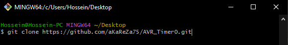
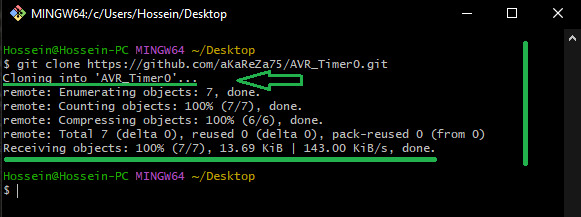
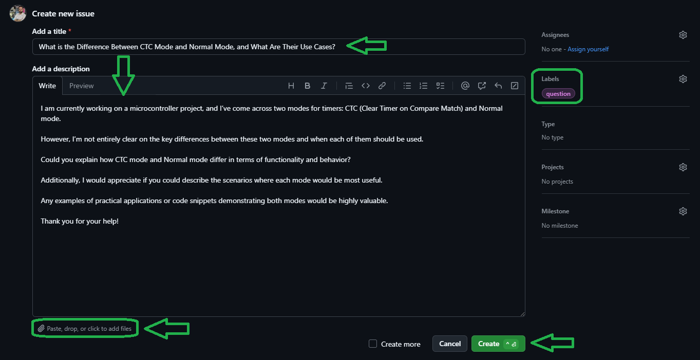

# Timer-Counter 0 in AVR Microcontrollers

Timer/Counter 0 is one of the timers integrated into the ATmega328 microcontroller. It is an 8-bit timer used to generate precise time delays, measure time intervals, and produce PWM (Pulse Width Modulation) signals. This timer can be configured in different modes, including normal, CTC (Clear Timer on Compare Match), and PWM (Pulse Width Modulation) modes. It is commonly used for generating time delays, controlling motors, and generating specific frequencies in embedded systems.

<table>
  <tr>
  <td valign="top">
  
  > [!TIP]  
  > If you're looking to better understand how to navigate and use my GitHub repositories — including exploring their structure, downloading or cloning projects, submitting issues, and asking questions,  
  > everything you need is clearly explained in this video:  
  > [aKaReZa 95 - Programming, Git - PART B](https://youtu.be/zYiUItVFRqQ)  
  > Make sure to check it out!
  
  </td>
    <td width="360" valign="middle" style="padding: 0;">
      <a href="https://youtu.be/zYiUItVFRqQ">
       
      </a>
    </td>

  </td>
  </tr>
  <tr>
  <td colspan="2">

  > [!CAUTION]
  > It is absolutely critical that you carefully read every single word of this document, line by line, to ensure you don't miss any details. Nothing can be overlooked.
      
  </td>
  </tr>  
</table>


# 🔗 Resources
  Here you'll find a collection of useful links and videos related to the topic of AVR microcontrollers.  
  
```
TIMER0 Overview
├── Documentation
│   ├─ [TIMER0 Modes]
│   │   ├─ Registers — TCCR0A, TCCR0B (WGM bits)
│   │   ├─ Modes — Normal, CTC, Fast PWM, Phase Correct PWM
│   │   └─ Examples — Mode switching and timing behavior
│   │
│   ├─ [TIMER0 Prescaler]
│   │   ├─ Register — TCCR0B (CS02:0)
│   │   ├─ Prescaler — Clock division and timer speed
│   │   └─ Effects — Impact on overflow and resolution
│   │
│   ├─ [TIMER0 Interrupts]
│   │   ├─ Registers — TIMSK0, TIFR0
│   │   ├─ Sources — Overflow, Compare Match A/B
│   │   └─ Control — Enable, flag clear, and ISR guide
│   │
│   ├─ [TIMER0 Outputs]
│   │   ├─ Registers — TCCR0A (COM bits), OC0A/B
│   │   ├─ Modes — Toggle, Clear, Set (normal/inverting)
│   │   └─ Usage — External output waveforms
│   │
│   ├─ [TIMER0 Other Registers]
│   │   ├─ TCNT0 — Timer/counter value
│   │   ├─ OCR0A — Compare match A value
│   │   └─ OCR0B — Compare match B value
│   │
│   ├─ [TIMER0 Time Calculation]
│   │   ├─ Inputs — TCNT0, OCR0A, prescaler
│   |   └─ Output — Overflow and match intervals
│   │
│   └─ [TIMER0 PWM Calculation]
│       ├─ Modes — Fast PWM, Phase Correct
│       └─ Math — PWM frequency and duty cycle
│
└── Registers
    ├─ [TCCR0A]  — Output Compare behavior & Waveform Generation Mode (Part 1)
    ├─ [TCCR0B]  — Clock Source selection, Prescaler setting & WGM bits (Part 2)
    ├─ [TCNT0]   — Timer/Counter register — Holds current timer count
    ├─ [OCR0A]   — Output Compare Register A — Match value for Channel A
    ├─ [OCR0B]   — Output Compare Register B — Match value for Channel B
    ├─ [TIMSK0]  — Interrupt Mask Register — Enable Timer0 interrupts
    └─ [TIFR0]   — Interrupt Flag Register — Indicates interrupt events
```

> [!TIP]
> The resources are detailed in the sections below.  
> To access any of them, simply click on the corresponding blue link.

- [TIMER0 Modes](./TIMER0_Modes.md)
  --- 
  This document provides a detailed overview of all waveform generation modes of Timer0, including Normal, CTC, Fast PWM, and Phase Correct PWM, with register configurations and practical examples.

- [TIMER0 Prescaler](./TIMER0_Prescaler.md)
  --- 
  This document explains how to configure the clock source and prescaler for Timer0, including detailed descriptions of all clock select bits and their effects on timer resolution and overflow frequency.

- [TIMER0 Interrupts](./TIMER0_Interrpts.md)
  --- 
  This file covers all interrupt-related features of Timer0 such as overflow, compare match A/B interrupts, and explains how to enable and clear them properly using TIMSK0 and TIFR0 registers.

- [TIMER0 Outputs](./Timer0_Outputs.md)
  --- 
  This document explains Compare Output Modes and how they affect the OC0A and OC0B pins in different timer modes, with practical configuration examples for normal, inverting, and non-inverting outputs.

- [TIMER0 Other Registers](./TIMER0_OtherRegisters.md)
  --- 
  This file provides a detailed description of Timer0 data and compare registers: `TCNT0`, `OCR0A`, and `OCR0B`. It explains how each register works, including bit-level information and their roles in compare match operations for Channel A and B.

- [TIMER0 Time Calculation](./Timer0_Time_Calc.md)
  --- 
  This document helps calculate the overflow time and compare match intervals in Normal and CTC modes based on prescaler and system clock, with practical examples and formulas.

- [TIMER0 PWM Calculation](./TIMER0_PWM_Calc.md)
  --- 
  This file shows how to calculate the output PWM frequency for Timer0 in both Fast PWM and Phase Correct PWM modes, using OCR0A as TOP and different prescaler settings.

```plaintext
AVR, Timer and PWM
   ├── [aKaReZa 59 - AVR, Timer, Accurate Time - Mode 1]
   │   ├─ Timer0 — Normal and CTC modes overview.
   │   ├─ Interrupts — Overflow vs Compare Match.
   │   ├─ Precision — Execution time and interval measurement.
   │   └─ Display — 7-segment usage + digit splitting method.
   │
   ├── [aKaReZa 105 - AVR, Timer, PWM - Mode 2]
   │   ├─ PWM Modes — Fast and Phase Correct (TOP variations).
   │   ├─ Comparison — OCR updates and waveform structure.
   │   ├─ Dual Slope — Signal symmetry and advantages.
   │   └─ Dead Time — Use cases in motor and power control.
   │
   └── [aKaReZa 108 - AVR, Servo Motor]
       ├─ Servo PWM — 50Hz signal generation and tuning.
       ├─ Timer1 — Mode 14 (Fast PWM) and Mode 10 (Phase Correct).
       └─ Precision — Angle control and signal comparisons.
```

<table style="border-collapse: collapse;">
  <tr>
    <td valign="top" style="padding: 0 10px;">
      <h3 style="margin: 0;">
        <a href="https://youtu.be/J1_z-FngLbA">aKaReZa 59 – AVR, Timer, Accurate Time, Mode 1</a>
      </h3>
      <p style="margin: 8px 0 0;">
        Learn about Timer-Counter 0 in AVR microcontrollers, Normal and CTC modes, Overflow and Compare Match interrupts, precise timing, function execution time calculation, and 7-segment display integration.
      </p>
    </td>
    <td width="360" valign="top" style="padding: 0;">
      <a href="https://youtu.be/J1_z-FngLbA">
        
      </a>
    </td>
  </tr>

  <tr>
    <td valign="top" style="padding: 0 10px;">
      <h3 style="margin: 0;">
        <a href="https://youtu.be/1GhoYor4q6M">aKaReZa 105 – AVR, Timer, PWM - Mode 2</a>
      </h3>
      <p style="margin: 8px 0 0;">
        A deep dive into PWM modes in AVR microcontrollers, covering Fast and Phase Correct PWM, dual slope advantages, Dead Time, and real-world applications in motors, converters, and LED drivers. Ideal for mastering PWM in practical engineering contexts.
      </p>
    </td>
    <td width="360" valign="top">
      <a href="https://youtu.be/1GhoYor4q6M">
        
      </a>
    </td>
  </tr>

  <tr>
    <td valign="top" style="padding: 0 10px;">
      <h3 style="margin: 0;">
        <a href="https://youtu.be/_RbzWU-bHc4">aKaReZa 108 – AVR, Servo Motor</a>
      </h3>
      <p style="margin: 8px 0 0;">
        Learn how to control a servo motor using AVR timers by generating precise 50Hz PWM signals. This video covers Timer0 basics, advanced Timer1 modes (Mode 14 and Mode 10), and high-precision angle control—perfect for mastering servo control in embedded systems.
      </p>
    </td>
    <td width="360" valign="top">
      <a href="https://youtu.be/_RbzWU-bHc4">
        
      </a>
    </td>
  </tr>
  
</table>

- [AVR Microntroller](https://github.com/aKaReZa75/AVR)
  ---  
    This repository contains comprehensive resources for AVR microcontrollers, including hardware schematics, software libraries, and educational projects.


# 💻 How to Use Git and GitHub
To access the repository files and save them on your computer, there are two methods available:
1. **Using Git Bash and Cloning the Repository**
   - This method is more suitable for advanced users and those familiar with command-line tools.
   - By using this method, you can easily receive updates for the repository.

2. **Downloading the Repository as a ZIP file**
   - This method is simpler and suitable for users who are not comfortable with command-line tools.
   - Note that with this method, you will not automatically receive updates for the repository and will need to manually download any new updates.

## Clone using the URL.
First, open **Git Bash** :
-  Open the folder in **File Explorer** where you want the library to be stored.
-  **Right-click** inside the folder and select the option **"Open Git Bash here"** to open **Git Bash** in that directory.


> [!NOTE] 
> If you do not see the "Open Git Bash here" option, it means that Git is not installed on your system.  
> You can download and install Git from [this link](https://git-scm.com/downloads).  
> For a tutorial on how to install and use Git, check out [this video](https://youtu.be/BsykgHpmUt8).
  
-  Once **Git Bash** is open, run the following command to clone the repository:

 ```bash
git clone https://github.com/aKaReZa75/AVR_Timer0.git
```
- You can copy the above command by either:
- Clicking on the **Copy** button on the right of the command.
- Or select the command text manually and press **Ctrl + C** to copy.
- To paste the command into your **Git Bash** terminal, use **Shift + Insert**.



- Then, press Enter to start the cloning operation and wait for the success message to appear.



> [!IMPORTANT]
> Please keep in mind that the numbers displayed in the image might vary when you perform the same actions.  
> This is because repositories are continuously being updated and expanded. Nevertheless, the overall process remains unchanged.

> [!NOTE]
> Advantage of Cloning the Repository:  
> - **Receiving Updates:** By cloning the repository, you can easily and automatically receive new updates.  
> - **Version Control:** Using Git allows you to track changes and revert to previous versions.  
> - **Team Collaboration:** If you are working on a project with a team, you can easily sync changes from team members and collaborate more efficiently.  

## Download Zip
If you prefer not to use Git Bash or the command line, you can download the repository directly from GitHub as a ZIP file.  
Follow these steps:  
1. Navigate to the GitHub repository page and Locate the Code button:
   - On the main page of the repository, you will see a green Code button near the top right corner.

2. Download the repository:
   - Click the Code button to open a dropdown menu.
   - Select Download ZIP from the menu.

    

3. Save the ZIP file:
   - Choose a location on your computer to save the ZIP file and click Save.

4. Extract the ZIP file:
   - Navigate to the folder where you saved the ZIP file.
   - Right-click on the ZIP file and select Extract All... (Windows) or use your preferred extraction tool.
   - Choose a destination folder and extract the contents.

5. Access the repository:
   - Once extracted, you can access the repository files in the destination folder.

> [!IMPORTANT]
> - No Updates: Keep in mind that downloading the repository as a ZIP file does not allow you to receive updates.    
>   If the repository is updated, you will need to download it again manually.  
> - Ease of Use: This method is simpler and suitable for users who are not comfortable with Git or command-line tools.

# 📝 How to Ask Questions
If you have any questions or issues, you can raise them through the **"Issues"** section of this repository. Here's how you can do it:  

1. Navigate to the **"Issues"** tab at the top of the repository page.  

  

2. Click on the **"New Issue"** button.  
   
  

3. In the **Title** field, write a short summary of your issue or question.  

4. In the "Description" field, detail your question or issue as thoroughly as possible. You can use text formatting, attach files, and assign the issue to someone if needed. You can also use text formatting (like bullet points or code snippets) for better readability.  

5. Optionally, you can add **labels**, **type**, **projects**, or **milestones** to your issue for better categorization.  

6. Click on the **"Submit new issue"** button to post your question or issue.
   
  

I will review and respond to your issue as soon as possible. Your participation helps improve the repository for everyone!  

> [!TIP]
> - Before creating a new issue, please check the **"Closed"** section to see if your question has already been answered.  
>     
> - Write your question clearly and respectfully to ensure a faster and better response.  
> - While the examples provided above are in English, feel free to ask your questions in **Persian (فارسی)** as well.  
> - There is no difference in how they will be handled!  

> [!NOTE]
> Pages and interfaces may change over time, but the steps to create an issue generally remain the same.

# 🤝 Contributing to the Repository
To contribute to this repository, please follow these steps:
1. **Fork the Repository**  
2. **Clone the Forked Repository**  
3. **Create a New Branch**  
4. **Make Your Changes**  
5. **Commit Your Changes**  
6. **Push Your Changes to Your Forked Repository**  
7. **Submit a Pull Request (PR)**  

> [!NOTE]
> Please ensure your pull request includes a clear description of the changes you’ve made.
> Once submitted, I will review your contribution and provide feedback if necessary.

# 🌟 Support Me
If you found this repository useful:
- Subscribe to my [YouTube Channel](https://www.youtube.com/@aKaReZa75).
- Share this repository with others.
- Give this repository and my other repositories a star.
- Follow my [GitHub account](https://github.com/aKaReZa75).

# 📜 License
This project is licensed under the GPL-3.0 License. This license grants you the freedom to use, modify, and distribute the project as long as you:
- Credit the original authors: Give proper attribution to the original creators.
- Disclose source code: If you distribute a modified version, you must make the source code available under the same GPL license.
- Maintain the same license: When you distribute derivative works, they must be licensed under the GPL-3.0 too.
- Feel free to use it in your projects, but make sure to comply with the terms of this license.
  
# ✉️ Contact Me
Feel free to reach out to me through any of the following platforms:
- 📧 [Email: aKaReZa75@gmail.com](mailto:aKaReZa75@gmail.com)
- 🎥 [YouTube: @aKaReZa75](https://www.youtube.com/@aKaReZa75)
- 💼 [LinkedIn: @akareza75](https://www.linkedin.com/in/akareza75)
