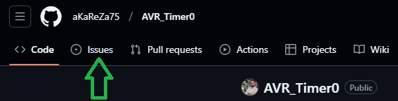

# Timer-Counter 0 in AVR Microcontrollers

Timer/Counter 0 is one of the timers integrated into the ATmega328 microcontroller. It is an 8-bit timer used to generate precise time delays, measure time intervals, and produce PWM (Pulse Width Modulation) signals. This timer can be configured in different modes, including normal, CTC (Clear Timer on Compare Match), and PWM (Pulse Width Modulation) modes. It is commonly used for generating time delays, controlling motors, and generating specific frequencies in embedded systems.

> [!CAUTION]
> It is absolutely critical that you carefully read every single word of this document, line by line, to ensure you don't miss any details. Nothing can be overlooked.

> [!TIP]
> If you're looking to better understand how to navigate and use my GitHub repositories — including exploring their structure, downloading or cloning projects, submitting issues, and asking questions 
> everything you need is clearly explained in this video:  
> [aKaReZa 95 - Programming, Git - PART B](https://youtu.be/zYiUItVFRqQ)   
> Make sure to check it out!

## Registers

Here is a list of the relevant registers for Timer/Counter 0, along with detailed descriptions of each bit:

### **TCCR0A (Timer/Counter Control Register A)**

| Bit | Description |
| --- | ----------- |
| 7   | COM0A1 (Compare Output Mode for Channel A) |
| 6   | COM0A0 (Compare Output Mode for Channel A) |
| 5   | COM0B1 (Compare Output Mode for Channel B) |
| 4   | COM0B0 (Compare Output Mode for Channel B) |
| 3   | Reserved |
| 2   | Reserved |
| 1   | WGM01 (Waveform Generation Mode) |
| 2   | WGM00 (Waveform Generation Mode) |

#### **WGM02/WGM01/WGM00 (Waveform Generation Mode)**

These bits select the waveform generation mode of the timer. The possible configurations are:

> [!CAUTION]
The WGM02 bit is located in the TCCR0B register.

| **Mode** | **WGM02** | **WGM01** | **WGM00** | **Timer/Counter Mode of Operation** | **TOP**  | **Update of OCRx at** | **TOV Flag Set on** |
|----------|-----------|-----------|-----------|-------------------------------------|----------|-----------------------|---------------------|
| 0        | 0         | 0         | 0         | Normal                              | 0xFF     | Immediate             | MAX                 |
| 1        | 0         | 0         | 1         | PWM, Phase Correct                 | 0xFF     | TOP                   | BOTTOM              |
| 2        | 0         | 1         | 0         | CTC                                 | OCR0A    | Immediate             | MAX                 |
| 3        | 0         | 1         | 1         | Fast PWM                            | 0xFF     | BOTTOM                | MAX                 |
| 4        | 1         | 0         | 0         | Reserved                           | -        | -                     | -                   |
| 5        | 1         | 0         | 1         | PWM, Phase Correct                 | OCR0A    | TOP                   | BOTTOM              |
| 6        | 1         | 1         | 0         | Reserved                           | -        | -                     | -                   |
| 7        | 1         | 1         | 1         | Fast PWM                            | OCR0A    | BOTTOM                | TOP                 |
 
* **MAX** = 0xFF   
* **BOTTOM** = 0x00

> [!CAUTION]
Pay close attention to the Update of OCRx at column. This is crucial for accurate timer operation, and failing to consider it could cause timing issues or unexpected behavior in your application.


### Explanation:
- **Normal Mode**: The timer counts from 0 to 255, and the overflow flag is set when it reaches 255.
- **CTC Mode**: The timer resets when it reaches the value in **OCR0A** or **OCR0B**, useful for generating periodic interrupts.
- **PWM, Phase Correct Mode**: The timer counts up and down, creating a symmetrical PWM waveform.
- **Fast PWM Mode**: The timer counts from 0 to 255, generating a PWM signal with a variable duty cycle, updated according to **OCR0A**.

> [!TIP]
The x can be either A or B, depending on whether you are configuring Channel A (OC0A) or Channel B (OC0B).

#### **Compare Output Mode, non-PWM Mode**

| **COM0x1** | **COM0x0** | **Description**                                              |
|------------|------------|--------------------------------------------------------------|
| 0          | 0          | Normal port operation, OCxA disconnected.                    |
| 0          | 1          | Toggle OCxA on Compare Match.                                |
| 1          | 0          | Clear OCxA on Compare Match.                                 |
| 1          | 1          | Set OCxA on Compare Match.                                   |

#### **Compare Output Mode, Fast PWM Mode**

| **COM0x1** | **COM0x0** | **Description**                                                     |
|------------|------------|---------------------------------------------------------------------|
| 0          | 0          | Normal port operation, OC0x disconnected.                           |
| 0          | 1          | WGM02 = 0: Normal Port Operation, OC0x Disconnected. WGM02 = 1: Toggle OC0x on Compare Match. |
| 1          | 0          | Clear OC0x on Compare Match, set OC0x at BOTTOM (non-inverting mode). |
| 1          | 1          | Set OC0x on Compare Match, clear OC0x at BOTTOM (inverting mode).   |

> [!NOTE] 
A special case occurs when **OCR0x** equals **TOP** and **COM0x1** is set. In this case, the compare match is ignored, but the set or clear is done at **BOTTOM**.

#### **Compare Output Mode, Phase Correct PWM Mode**

| **COM0x1** | **COM0x0** | **Description**                                                       |
|------------|------------|-----------------------------------------------------------------------|
| 0          | 0          | Normal port operation, OC0x disconnected.                             |
| 0          | 1          | WGM02 = 0: Normal Port Operation, OC0x Disconnected. WGM02 = 1: Toggle OC0x on Compare Match. |
| 1          | 0          | Clear OC0x on Compare Match when up-counting. Set OC0x on Compare Match when down-counting. |
| 1          | 1          | Set OC0x on Compare Match when up-counting. Clear OC0x on Compare Match when down-counting. |

> [!NOTE] 
A special case occurs when **OCR0x** equals **TOP** and **COM0x1** is set. In this case, the compare match is ignored, but the set or clear is done at **TOP**.

---

### **TCCR0B (Timer/Counter Control Register B)**

| Bit | Description |
| --- | ----------- |
| 7   | FOC0A (Force Output Compare A) |
| 6   | FOC0B (Force Output Compare B) |
| 5   | Reserved |
| 4   | Reserved |
| 3   | WGM02 (Waveform Generation Mode) |
| 2   | CS02 (Clock Select) |
| 1   | CS01 (Clock Select) |
| 0   | CS00 (Clock Select) |

- **FOC0A/FOC0B**: Forces an immediate compare match to occur, which can be used to trigger an interrupt or other event.
- **WGM02**: Combines with WGM01 and WGM00 from TCCR0A to define the waveform generation mode.

#### **Clock Select Bit Description**
Determine the clock source for the timer (e.g., No clock, prescaler, etc.).

| **CS02** | **CS01** | **CS00** | **Description**                                           |
|----------|----------|----------|-----------------------------------------------------------|
| 0        | 0        | 0        | No clock source (Timer/Counter stopped)                   |
| 0        | 0        | 1        | clk_I/O (No prescaling)                                  |
| 0        | 1        | 0        | clk_I/O / 8 (From prescaler)                              |
| 0        | 1        | 1        | clk_I/O / 64 (From prescaler)                             |
| 1        | 0        | 0        | clk_I/O / 256 (From prescaler)                            |
| 1        | 0        | 1        | clk_I/O / 1024 (From prescaler)                           |
| 1        | 1        | 0        | External clock source on T0 pin. Clock on falling edge.  |
| 1        | 1        | 1        | External clock source on T0 pin. Clock on rising edge.   |

> [!TIP]
The **External clock source** can be used in two modes for the **Counter Mode**:  
- Clock on falling edge
- Clock on rising edge

---

### **TIMSK0 (Timer/Counter Interrupt Mask Register)**

| Bit | Description |
| --- | ----------- |
| 7-3 | Reserved |
| 2   | OCIE0B (Output Compare B Interrupt Enable) |
| 1   | OCIE0A (Output Compare A Interrupt Enable) |
| 0   | TOIE0 (Overflow Interrupt Enable) |

- **OCIE0B**: Enable interrupts on output compare matches for Channel B.
- **OCIE0A**: Enable interrupts on output compare matches for Channel A.
- **TOIE0**: Enable Timer/Counter overflow interrupt.

---

### **TIFR0 (Timer/Counter Interrupt Flag Register)**

| Bit | Description |
| --- | ----------- |
| 7-3 | Reserved |
| 2   | OCF0B (Output Compare B Flag) |
| 1   | OCF0A (Output Compare A Flag) |
| 0   | TOV0 (Timer/Counter Overflow Flag) |

- **OCF0B**: Flags set on compare match events for Channels B.
- **OCF0A**: Flags set on compare match events for Channels A.
- **TOV0**: Flag set on overflow of Timer/Counter 0.

--

### **TCNT0 (Timer/Counter Register)**

| Bit | Description |
| --- | ----------- |
| 7-0 | TCNT0 (Timer/Counter Value) |

- **TCNT0**: The current value of the Timer/Counter. It increments with each clock cycle (or according to the prescaler).

---

### **OCR0A (Output Compare Register A)**

| Bit | Description |
| --- | ----------- |
| 7-0 | OCR0A (Output Compare A Value) |

- **OCR0A**: Holds the value for the output compare match for Channel A. The timer will reset when TCNT0 matches OCR0A, triggering an interrupt if enabled.

---

### **OCR0B (Output Compare Register B)**

| Bit | Description |
| --- | ----------- |
| 7-0 | OCR0B (Output Compare B Value) |

- **OCR0B**: Holds the value for the output compare match for Channel B. Similar to OCR0A but for Channel B.


## **Time Calculation**

### Normal Mode

The time period for **Timer/Counter 0** to overflow or for a compare match can be calculated as:

```
T = (N * 256) / f_clk
```

Where:
- `N` is the prescaler value.
- `256` is the maximum value the timer can count to before overflowing (in **Normal mode**).
- `f_clk` is the system clock frequency.

#### **Example Calculation for Time**

For a **16 MHz** clock and a **prescaler of 64**, the time period for a **Timer/Counter 0** overflow would be:

```
T = (64 * 256) / 16,000,000 = 16,384 / 16,000,000 = 1.024 ms
```

| **Prescaler** | **Time (ms)** |
|---------------|---------------|
| 1             | 0.016         |
| 8             | 0.128         |
| 64            | 1.024         |
| 256           | 4.096         |
| 1024          | 16.384        |

This table shows the time period for a **Timer/Counter 0** overflow for different prescaler values, with a **16 MHz** clock and a **max count of 256** before overflow.

---

#### **Time Calculation with TCNT0**

If you want to reach different time intervals in Normal mode, you need to initialize the TCNT0 register to the desired value. After setting TCNT0, you can calculate the time for the timer to reach that specific value before overflowing.

```
T = ((256 - TCNT0) * N) / f_clk
```

Where:
- `TCNT0` is the current value in the **TCNT0** register (the timer's current count).
- `N` is the prescaler value.
- `f_clk` is the system clock frequency.

#### **Example Calculation for Time Using TCNT0**

If you want the interrupt to occur **1 millisecond** after the current value in **TCNT0**, let's calculate it for a **prescaler of 64** with a **16 MHz** clock.

- We want the interrupt to occur after **1 millisecond** (`T = 1 ms`).
- The formula is:  
  ```
  T = ((256 - TCNT0) * N) / f_clk
  ```

We know:
- `T = 1 ms = 0.001 s`
- `N = 64`
- `f_clk = 16,000,000 Hz`

We can rearrange the formula to find the value of **TCNT0**:

```
0.001 = ((256 - TCNT0) * 64) / 16,000,000
```

Solving for **TCNT0**:

```
16,000 = (256 - TCNT0) * 64
(256 - TCNT0) = 16,000 / 64
(256 - TCNT0) = 250
TCNT0 = 256 - 250
TCNT0 = 6
```

Since **TCNT0** is an integer register, you would round **TCNT0** to **6**.

So, if you want an interrupt to occur **1 millisecond** after the timer starts counting with a **prescaler of 64** and a **16 MHz** clock, you would set **TCNT0** to **6**.

> [!IMPORTANT]
You must re-set the TCNT0 register to the calculated value (6 in this case) at the end of the OVF (overflow) interrupt. This is crucial to maintain the timing accuracy, as failing to do so will result in incorrect timing and cause the timer to miss the intended interrupt intervals.

```c
ISR(TIMER0_OVF_vect)
{
    TCNT0 = 6;
};
```

---

### CTC Mode

In **CTC (Clear Timer on Compare Match)** mode, the timer is cleared when it matches the value in the **OCR0A** register. The period for **Timer/Counter 0** in **CTC mode** can be calculated as:

```
T = (N * (OCR0A + 1)) / f_clk
```

Where:
- `OCR0A` is the value in the **OCR0A** register (the compare match value).
- `N` is the prescaler value.
- `f_clk` is the system clock frequency.

#### **Example Calculation for Time in CTC Mode**

For a **16 MHz** clock, a **prescaler of 64**, and **OCR0A = 249**, the time period would be:

```
T = (64 * (249 + 1)) / 16,000,000 = (64 * 250) / 16,000,000 = 16,000 / 16,000,000 = 1 ms
```

In **CTC mode**, the timer counts from 0 to **OCR0A** before resetting, which is useful for generating precise periodic interrupts.

> [!TIP]
In Normal mode, we are typically looking for the Overflow interrupt (OVF). However, in CTC mode, we are looking for the Compare Match interrupt to trigger the event when the timer matches the value in OCR0A.

## API Reference

This section provides the necessary API functions to interact with Timer/Counter 0. These functions are designed for direct manipulation of the registers.

> [!NOTE]  
> The library and all of its APIs provided below have been developed by myself.  
This library utilizes various macros defined in the `aKaReZa.h` header file, which are designed to simplify bitwise operations and register manipulations.    
Detailed descriptions of these macros can be found at the following link:  
> [https://github.com/aKaReZa75/AVR/blob/main/Macros.md](https://github.com/aKaReZa75/AVR/blob/main/Macros.md)  


> [!CAUTION]
Always ensure that global interrupts are enabled using the `sei()` function. Without enabling global interrupts, the microcontroller will not respond to any interrupt triggers.  
The `sei()` function sets the Global Interrupt Flag (I-bit) in the Status Register (SREG), which allows interrupt requests to be processed by the microcontroller.

You can use the following macros to enable and disable global interrupts:

- **`globalInt_Enable`**: This macro is equivalent to calling `sei()`. It enables global interrupts, allowing the microcontroller to respond to interrupt requests.

- **`globalInt_Disable`**: This macro is equivalent to calling `cli()`. It disables global interrupts, preventing the microcontroller from processing any interrupts.

 * @param _initStatus A boolean indicating whether to initialize (`Initialize`) or deinitialize (`deInitialize`) the Interrupt.

---

### **Timer0_Init**
```c
void Timer0_Init(bool _initStatus);
```
- **Initialization**:
  - Initializes Timer/Counter 0.
  - Sets up the necessary configuration for the timer including prescaler, mode of operation, and interrupt settings.
  - **_initStatus**: 
    - If `_initStatus` is set to `Initialize`, Timer/Counter 0 will be initialized and start running.
    - If `_initStatus` is set to `deInitialize`, Timer/Counter 0 will be disabled and reset.

**Example:**
```c
#include "aKaReZa.h"
#include "timer0.h"

int main(void) 
{
    Timer0_Init(Initialize); /**< Initialize Timer0*/
    while(1)
    {
        /* Main program */
    };
};
```

---

### **ISR (Interrupt Service Routine) for Timer/Counter 0**

Timer/Counter 0 has several interrupt sources that allow you to trigger actions based on specific events. Below are the interrupts that can be enabled for **Timer/Counter 0**:

1. **Overflow Interrupt (TOIE0)**:
   - Triggered when Timer/Counter 0 overflows (i.e., when TCNT0 reaches 0xFF and the timer rolls over to 0).
   - **Interrupt Flag**: **TOV0** in the **TIFR0** register.
   - To enable the interrupt: Set the **TOIE0** bit in the **TIMSK0** register.
```c
ISR(TIMER0_OVF_vect)
{
    /* Code to execute when Timer0 overflows */
}
```

2. **Output Compare Match Interrupt A (OCIE0A)**:
   - Triggered when the value of **TCNT0** matches the value in **OCR0A**.
   - **Interrupt Flag**: **OCF0A** in the **TIFR0** register.
   - To enable the interrupt: Set the **OCIE0A** bit in the **TIMSK0** register.
```c
ISR(TIMER0_COMPA_vect)
{
    /* Code to execute when Timer0 Compare Match A */
}
```

3. **Output Compare Match Interrupt B (OCIE0B)**:
   - Triggered when the value of **TCNT0** matches the value in **OCR0B**.
   - **Interrupt Flag**: **OCF0B** in the **TIFR0** register.
   - To enable the interrupt: Set the **OCIE0B** bit in the **TIMSK0** register.
```c
ISR(TIMER0_COMPB_vect)
{
    /* Code to execute when Timer0 Compare Match B */
}
```

## Summary

| API                    | Description                                  |
| ---------------------- | -------------------------------------------- |
| `Timer0_Init`          | Initializes or deinitializes Timer/Counter 0 |
| `ISR(TIMER0_OVF_vect)` | Interrupt Service Routine for Timer0 overflow |
| `ISR(TIMER0_COMPA_vect)` | Interrupt Service Routine for Output Compare Match A |
| `ISR(TIMER0_COMPB_vect)` | Interrupt Service Routine for Output Compare Match B |

## Complete Example

```c
#include "aKaReZa.h"
#include "Timer0.h"

ISR(TIMER0_OVF_vect)
{
    /* Code to execute when Timer0 overflows */
}

int main(void)
{
    Timer0_Init(Initialize); /**< Initialize Timer0 with default settings */
    
    bitSet(TIMSK0, TOIE0); /**< Enable overflow interrupt */
    
    while(1)
    {
        /* Main program */
    };
};
```

## Important Notes

- When using Timer/Counter 0, ensure that the prescaler and waveform generation mode are configured correctly for your desired application.
- The overflow interrupt can be enabled using `TOIE0` in the `TIMSK0` register, but remember to handle the interrupt service routine (ISR) properly to avoid unwanted behavior.
- The `OCR0A` and `OCR0B` registers determine the compare match points for generating PWM signals or triggering interrupts.
- Common mistakes include not correctly setting the prescaler or misconfiguring the waveform generation mode, which can result in unexpected timer behavior.

# 🔗 Resources
  Here you'll find a collection of useful links and videos related to the topic of AVR microcontrollers.  
  
> [!TIP]
> The resources are detailed in the sections below.  
> To access any of them, simply click on the corresponding blue link.

- [aKaReZa 59 - AVR, Timer, Accurate Time, Mode 1](https://youtu.be/J1_z-FngLbA)  
  ---  
    Learn about Timer-Counter 0 in AVR microcontrollers, Normal and CTC modes, Overflow and Compare Match interrupts, precise timing, function execution time calculation, and 7-segment display integration.


- [AVR Microntroller](https://github.com/aKaReZa75/AVR)
  ---  
    This repository contains comprehensive resources for AVR microcontrollers, including hardware schematics, software libraries, and educational projects.


# 💻 How to Use Git and GitHub
To access the repository files and save them on your computer, there are two methods available:
1. **Using Git Bash and Cloning the Repository**
   - This method is more suitable for advanced users and those familiar with command-line tools.
   - By using this method, you can easily receive updates for the repository.

2. **Downloading the Repository as a ZIP file**
   - This method is simpler and suitable for users who are not comfortable with command-line tools.
   - Note that with this method, you will not automatically receive updates for the repository and will need to manually download any new updates.

## Clone using the URL.
First, open **Git Bash** :
-  Open the folder in **File Explorer** where you want the library to be stored.
-  **Right-click** inside the folder and select the option **"Open Git Bash here"** to open **Git Bash** in that directory.


> [!NOTE] 
> If you do not see the "Open Git Bash here" option, it means that Git is not installed on your system.  
> You can download and install Git from [this link](https://git-scm.com/downloads).  
> For a tutorial on how to install and use Git, check out [this video](https://youtu.be/BsykgHpmUt8).
  
-  Once **Git Bash** is open, run the following command to clone the repository:

 ```bash
git clone https://github.com/aKaReZa75/AVR_Timer0.git
```
- You can copy the above command by either:
- Clicking on the **Copy** button on the right of the command.
- Or select the command text manually and press **Ctrl + C** to copy.
- To paste the command into your **Git Bash** terminal, use **Shift + Insert**.


- Then, press Enter to start the cloning operation and wait for the success message to appear.


> [!IMPORTANT]
> Please keep in mind that the numbers displayed in the image might vary when you perform the same actions.  
> This is because repositories are continuously being updated and expanded. Nevertheless, the overall process remains unchanged.

> [!NOTE]
> Advantage of Cloning the Repository:  
> - **Receiving Updates:** By cloning the repository, you can easily and automatically receive new updates.  
> - **Version Control:** Using Git allows you to track changes and revert to previous versions.  
> - **Team Collaboration:** If you are working on a project with a team, you can easily sync changes from team members and collaborate more efficiently.  

## Download Zip
If you prefer not to use Git Bash or the command line, you can download the repository directly from GitHub as a ZIP file.  
Follow these steps:  
1. Navigate to the GitHub repository page and Locate the Code button:
   - On the main page of the repository, you will see a green Code button near the top right corner.

2. Download the repository:
   - Click the Code button to open a dropdown menu.
   - Select Download ZIP from the menu.

    

3. Save the ZIP file:
   - Choose a location on your computer to save the ZIP file and click Save.

4. Extract the ZIP file:
   - Navigate to the folder where you saved the ZIP file.
   - Right-click on the ZIP file and select Extract All... (Windows) or use your preferred extraction tool.
   - Choose a destination folder and extract the contents.

5. Access the repository:
   - Once extracted, you can access the repository files in the destination folder.

> [!IMPORTANT]
> - No Updates: Keep in mind that downloading the repository as a ZIP file does not allow you to receive updates.    
>   If the repository is updated, you will need to download it again manually.  
> - Ease of Use: This method is simpler and suitable for users who are not comfortable with Git or command-line tools.

# 📝 How to Ask Questions
If you have any questions or issues, you can raise them through the **"Issues"** section of this repository. Here's how you can do it:  

1. Navigate to the **"Issues"** tab at the top of the repository page.  

  

2. Click on the **"New Issue"** button.  
   
  

3. In the **Title** field, write a short summary of your issue or question.  

4. In the "Description" field, detail your question or issue as thoroughly as possible. You can use text formatting, attach files, and assign the issue to someone if needed. You can also use text formatting (like bullet points or code snippets) for better readability.  

5. Optionally, you can add **labels**, **type**, **projects**, or **milestones** to your issue for better categorization.  

6. Click on the **"Submit new issue"** button to post your question or issue.
   
  

I will review and respond to your issue as soon as possible. Your participation helps improve the repository for everyone!  

> [!TIP]
> - Before creating a new issue, please check the **"Closed"** section to see if your question has already been answered.  
>     
> - Write your question clearly and respectfully to ensure a faster and better response.  
> - While the examples provided above are in English, feel free to ask your questions in **Persian (فارسی)** as well.  
> - There is no difference in how they will be handled!  

> [!NOTE]
> Pages and interfaces may change over time, but the steps to create an issue generally remain the same.

# 🤝 Contributing to the Repository
To contribute to this repository, please follow these steps:
1. **Fork the Repository**  
2. **Clone the Forked Repository**  
3. **Create a New Branch**  
4. **Make Your Changes**  
5. **Commit Your Changes**  
6. **Push Your Changes to Your Forked Repository**  
7. **Submit a Pull Request (PR)**  

> [!NOTE]
> Please ensure your pull request includes a clear description of the changes you’ve made.
> Once submitted, I will review your contribution and provide feedback if necessary.

# 🌟 Support Me
If you found this repository useful:
- Subscribe to my [YouTube Channel](https://www.youtube.com/@aKaReZa75).
- Share this repository with others.
- Give this repository and my other repositories a star.
- Follow my [GitHub account](https://github.com/aKaReZa75).

# 📜 License
This project is licensed under the GPL-3.0 License. This license grants you the freedom to use, modify, and distribute the project as long as you:
- Credit the original authors: Give proper attribution to the original creators.
- Disclose source code: If you distribute a modified version, you must make the source code available under the same GPL license.
- Maintain the same license: When you distribute derivative works, they must be licensed under the GPL-3.0 too.
- Feel free to use it in your projects, but make sure to comply with the terms of this license.
  
# ✉️ Contact Me
Feel free to reach out to me through any of the following platforms:
- 📧 [Email: aKaReZa75@gmail.com](mailto:aKaReZa75@gmail.com)
- 🎥 [YouTube: @aKaReZa75](https://www.youtube.com/@aKaReZa75)
- 💼 [LinkedIn: @akareza75](https://www.linkedin.com/in/akareza75)
